# 📖📖 OpenLeaf (Flutter eBook App) 

A simple Flutter app to Read and Download books. The Books included in the app
are from the [Public Domain](https://en.wikipedia.org/wiki/Public_domain)
(Expired Copyright and completely free).

 

The [Feedbooks API](http://www.feedbooks.com/api) was used to fetch books.  
 
<a href="https://www.vecteezy.com/vector-art/599678-book-reading-logo-and-symbols-template-icons">App
icon</a>    
To download this app, <a href="https://codemagic.io/apps/5e230defc5faa60315b1df62/5e230defc5faa60315b1df61/latest_build">click here</a> to see the codemagic builds. You can choose to install the `apk`.
You can download from the appstore if you use an iPhone, iPad or a Mac with Silicon chip.
 
<a href="https://apps.apple.com/app/openleaf/id6450374275"></img></a>
  Please star⭐ the repo if you like what you see😉.

## 💻 Requirements

- Any Operating System (ie. MacOS X, Linux, Windows)
- Any IDE with Flutter SDK installed (ie. IntelliJ, Android Studio, VSCode etc)
- A little knowledge of Dart and Flutter

## ✨ Features

- [x] Download eBooks.
- [x] Read eBooks.
- [x] Favorites.
- [x] Dark Mode
- [x] Swipe to delete downloads.

## 📸 ScreenShots

<!-- 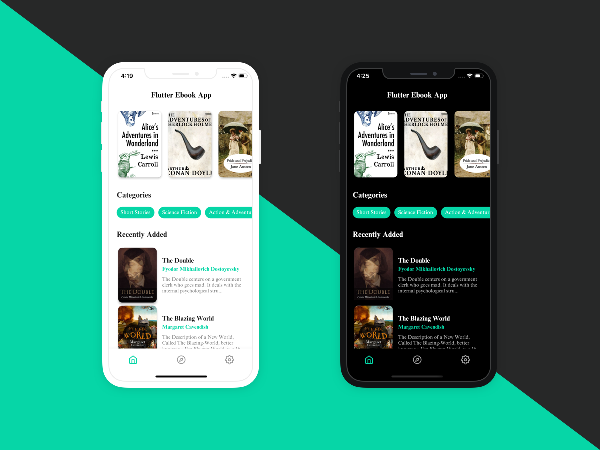 -->

| Light                             | Dark                              |
| --------------------------------- | --------------------------------- |
| 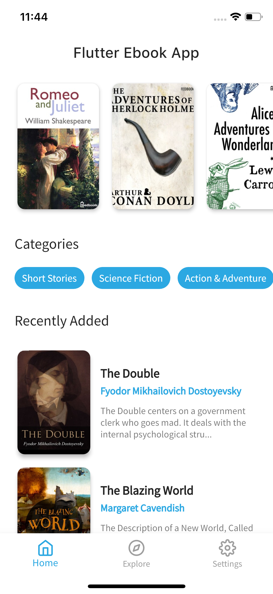  | 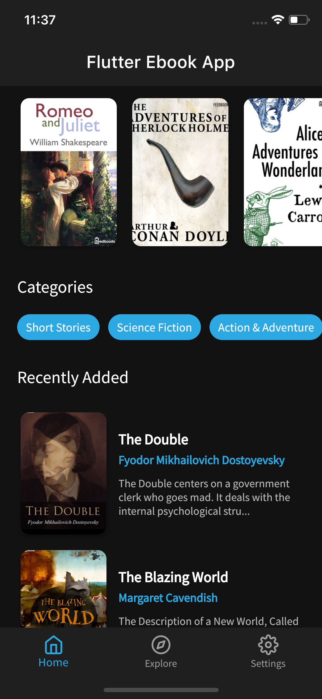  |
| 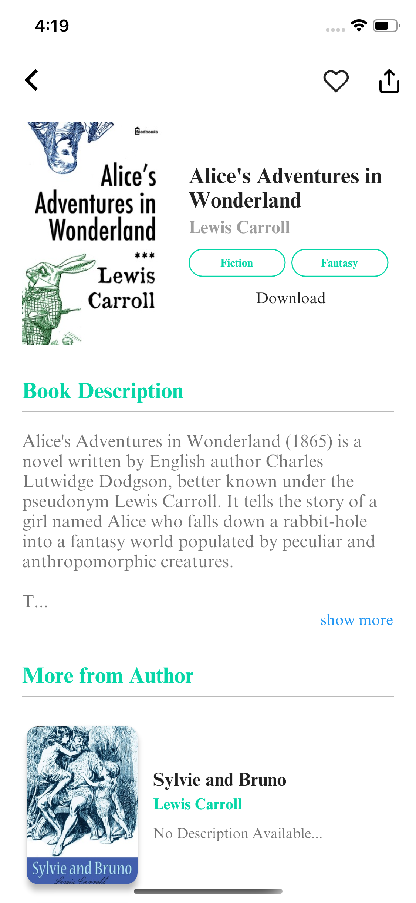  | 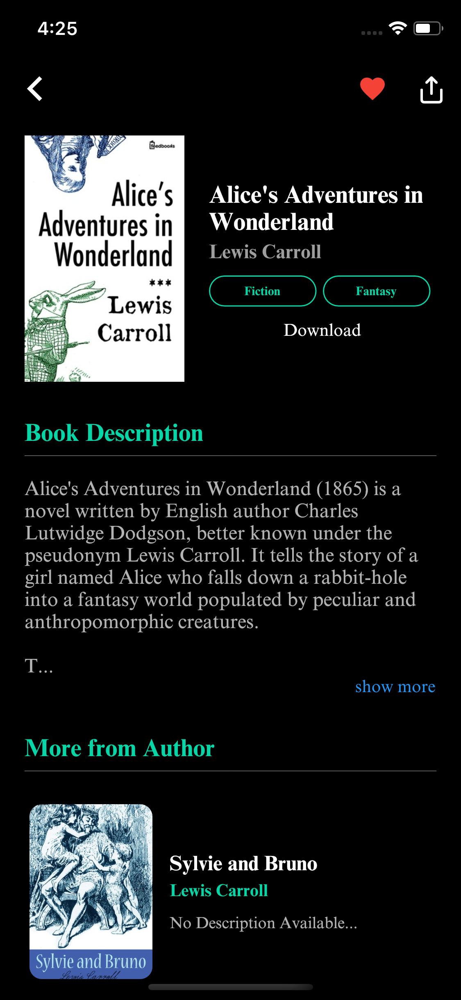  |
| 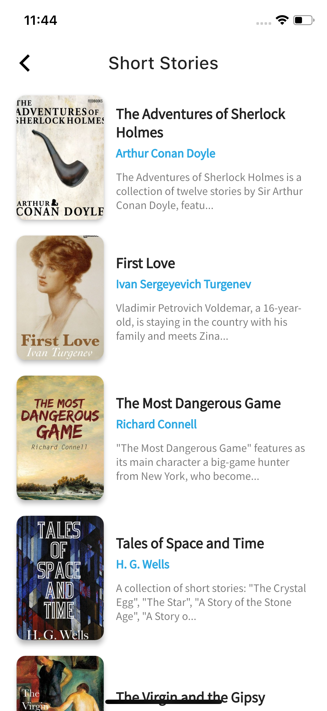  | 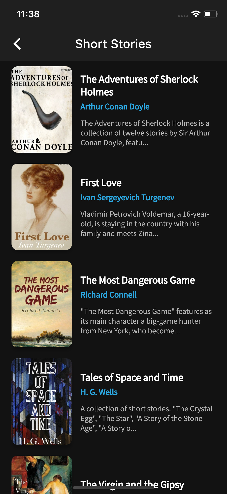  |
|   | 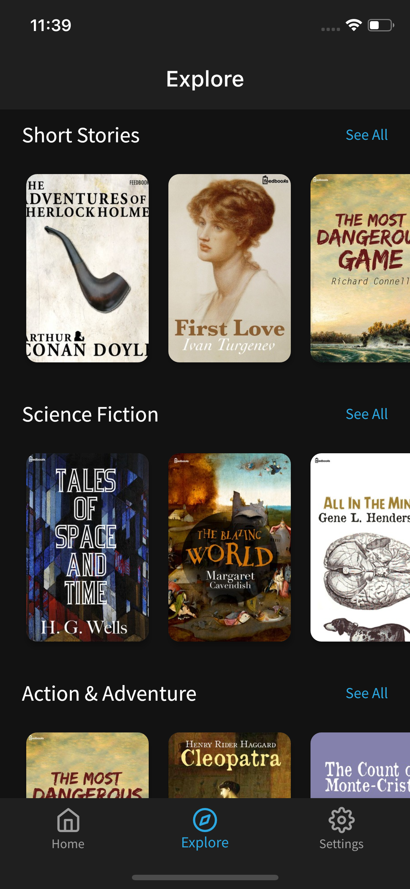  |
| 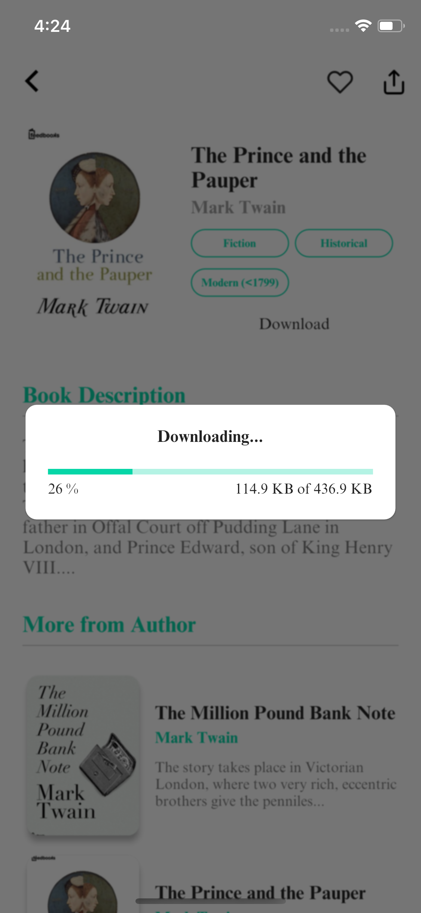  |  |
| 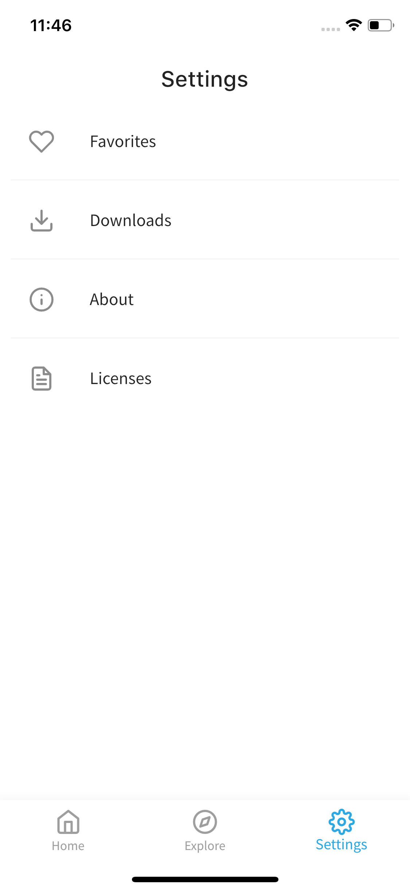 | 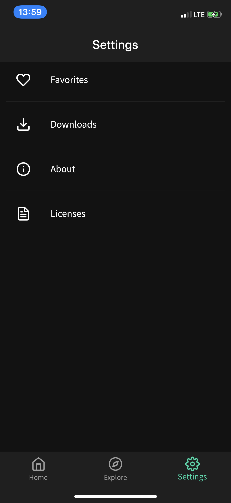 |
| 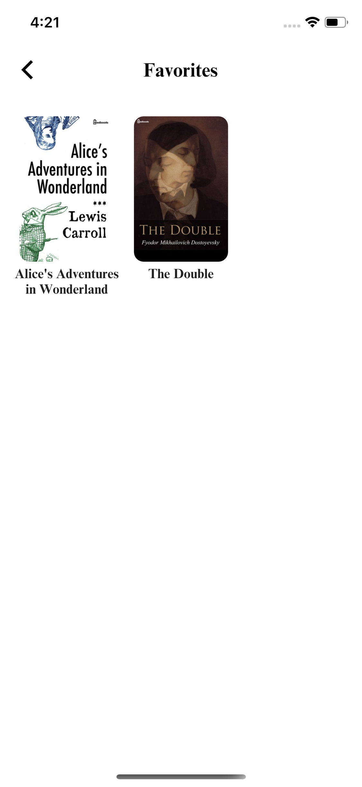 |  |

##### Desktop

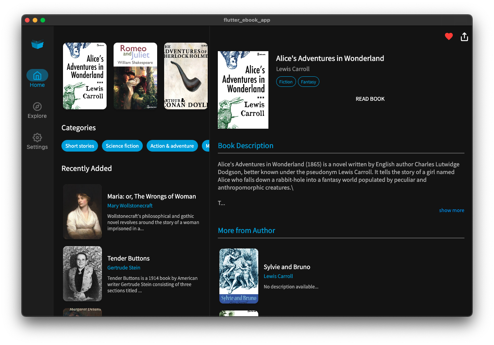

## 🔌 Plugins

| Name                                                                   | Usage                                         |
| ---------------------------------------------------------------------- | --------------------------------------------- |
| [**Riverpod**](https://pub.dev/packages/flutter_riverpod)              | State Management                              |
| [**Sembast**](https://pub.dev/packages/sembast)                        | NoSQL database to store Favorites & Downloads |
| [**XML2JSON**](https://pub.dev/packages/xml2json)                      | Convert XML to JSON                           |
| [**DIO**](https://pub.dev/packages/dio)                                | Network calls and File Download               |
| [**Iridium Reader**](https://github.com/Mantano/iridium_reader_widget) | Plug and play reader widget for epubs         |

## 🤓 Author(s)

**Festus Babajide Olusegun**

## 🔖 LICENCE

[Apache-2.0](https://github.com/JideGuru/FlutterEbookApp/blob/master/LICENSE)

